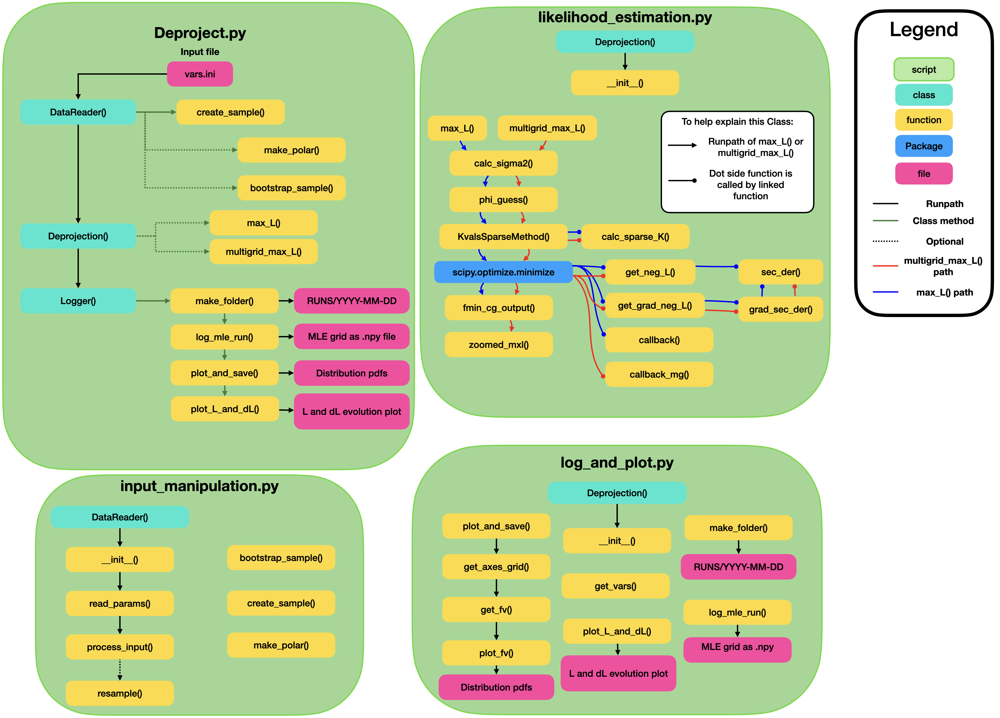

# DeprojectionProject

### Introduction

This repository contains the code that was developed by Daniel Mikkola, Paul McMillan, and John Wimarsson and based upon [Dehnen (1998)](https://ui.adsabs.harvard.edu/abs/1998AJ....115.2384D/abstract). It was subsequently used for two separate publications:

#### [Mikkola et al. (2022)](https://ui.adsabs.harvard.edu/abs/2022MNRAS.512.6201M/abstract)
#### [Mikkola et al. (2023)](https://ui.adsabs.harvard.edu/abs/2023MNRAS.519.1989M/abstract)

For questions regarding the code you can reach out to either Daniel Mikkola or Paul McMillan.

### Basic running.

The code consists mostly of four scripts.
- Deproject.py
- input_manipulation.py (For DataReader class)
- likelihood_esimation.py (For Deproject class)
- log_and_plot.py (For Logger class)

The main script you run is **Deproject.py** which imports the other three scripts and makes use of the three classes **DataReader**, **Deproject**, and **Logger**. How these classes and functions relate to each other can be best understood by studying the code and the following flowchart of operations:



To run the code, you need to use Python on the terminal with the following command

```python
python Deproject.py -i $INIFILE
```
Where the `$INIFILE` is your specified initial conditions file.

#### Test case
There exists a test case, to make sure you are up and running correctly. Have a look in `INIT/example.ini` which makes use of the datafile `DATA/SN_example.vot`. You should be able to run
```python
python Deproject.py -i INIT/example.ini
```
which would reproduce the files located in `RUNS/2023-01-13a` if all is well.

### Requirements.
Some things are necessary for things to run smoothly (and some are fulfilled by default when you clone the directory)
- You must have the directories `RUNS`, `DATA` and `INIT`.
- You must provide a `.vot` datafile. If you feel brave enough, you can always hack the code to accept other inputs.

### Concluding remarks
That's it. There should be good docstrings available for all of the functions used and comments scattered throughout the code to help you understand how things work. The general principles of the code is best understood (for now until such a time that I write an exaplanation here) by reading the published papers.

# Good luck!